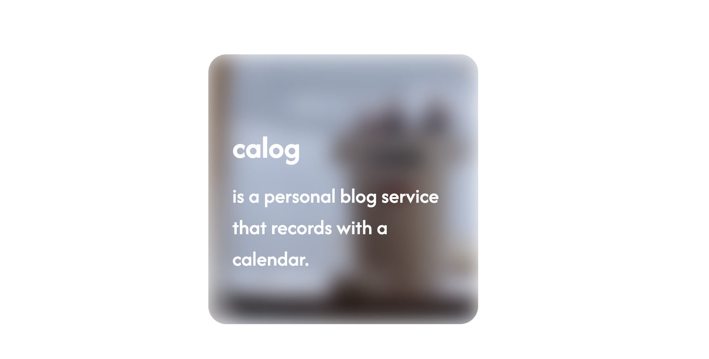
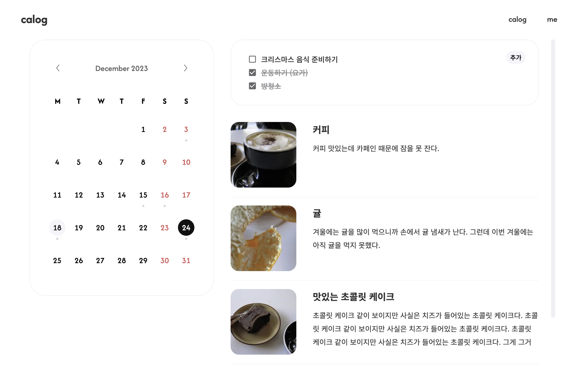

# Calog

## About

> 일정 관리와 함께 하루를 기록하는 웹 사이트  
> (2023.12.15 ~ 아직 구현중)




### Features

### Goals

1. 재사용이 **쉬운** 컴포넌트 설계 ([components/ui](components/ui/) 폴더)
2. Server-side Rendering (SSR) 및 Static Site Generation 적합한 곳에 사용하기
3. 인증 구현

### Technologies Used

|               |         사용 기술          |
| :-----------: | :------------------------: |
|     코어      | React, Next.js, TypeScript |
|   상태 관리   | Recoil, React Query (예정) |
|   스타일링    |    CSS Module, Emotion     |
|    포맷팅     |      ESLint, Prettier      |
| 패키지 매니저 |         Yarn Berry         |

<br />

## Components/Hooks

### components/ui

**`Callout`**

```js
<Callout backgroundColor="#f4f4f4">
  <p>some text...</p>
</Callout>
```

- 컨텐츠 강조 카드
- toggle 여부, background/border/아이콘 색상 등 스타일 커스텀 가능

**`HoverBlurCard`**

```js
<HoverBlurCard imgSrc="/images/background.jpg" imgAlt="background">
  <h2>title</h2>
  <p>description</p>
</HoverBlurCard>
```

- 마우스 hover 시 배경 이미지 블러 효과와 텍스트가 나타나는 카드
- 배경 이미지 및 클릭 시 이동할 경로 커스텀 가능

**`MediaObjectCard`**

```js
<MediaObjectCard type="avatar" imgSrc="/images/avatar.jpg" imgAlt="user avatar">
  <h2>{user.name}</h2>
  <p>{user.message}</p>
</MediaObjectCard>
```

- 이미지와 텍스트를 함께 배치하는 카드
- type: 'avatar' | 'post' (제한적 스타일로 이후 유연한 스타일로 변경 예정)

**`Toggle`**

```js
<Toggle
  hasPlaceholder={true}
  showContentButtonText="add",
  hideContentButtonText="delete",
  placeholderText="add new text"
>
  <form onSubmit={submitHandler}>
    <input type="text" />
    <button>submit</button>
  </form>
</Toggle>
```

- 컨텐츠의 visibility를 컨트롤 하는 버튼이 포함된 컨테이너
- 버튼 및 placeholder 커스텀 가능
- `callbackFn` : toggle 버튼 누를 때마다 실행할 콜백 함수 지정

### Custom Hooks

| Hooks                 | 설명                                                 |
| --------------------- | ---------------------------------------------------- |
| `useEscKey`           | esc 키 이벤트 발생 시 콜백 함수 실행시키는 커스텀 훅 |
| `useToggleVisibility` | 컨텐츠의 visibility를 관리하는 커스텀 훅             |

<br />

## TODO

> 현재 더미데이터 사용하여 상태 관리 중

- [x] Recoil을 사용한 상태 관리
- [ ] API 통신
- [x] 캘린더 스타일링
- [ ] linear gradient 스타일링
- [ ] 인증
